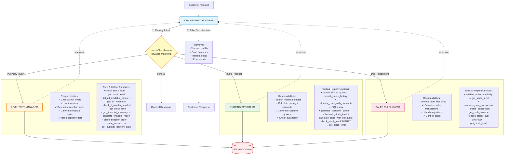

# PaperFlow AI - Multi-Agent System Workflow Diagram

## Overview

This document provides the complete architecture diagram for the PaperFlow AI multi-agent system, showing all 4 agents (1 orchestrator + 3 specialists), their tools, helper functions, and orchestration logic.

---

## Mermaid Diagram



---

## Agent Responsibilities Summary

### 1. **Orchestrator Agent**

- **Responsibility**: Central routing and coordination
- **Tools**: None (uses decision logic)
- **Decision Logic**:
  - Classifies intent using keyword matching
  - Routes to appropriate specialist agent
  - Filters sensitive internal information before returning responses

### 2. **Inventory Manager Agent**

- **Responsibility**: Manage inventory levels, supplier orders, and financial reporting
- **Tools** (5):
  1. `check_stock_level` → uses `get_stock_level()`
  2. `list_all_available_items` → uses `get_all_inventory()`
  3. `check_if_reorder_needed` → uses `get_stock_level()` + SQL queries
  4. `get_financial_summary` → uses `generate_financial_report()`
  5. `place_supplier_order` → uses `create_transaction()` + `get_supplier_delivery_date()`

### 3. **Quoting Specialist Agent**

- **Responsibility**: Generate competitive quotes with strategic discounts
- **Tools** (4):
  1. `search_similar_quotes` → uses `search_quote_history()`
  2. `calculate_price_with_discounts` → uses SQL queries to inventory table
  3. `generate_customer_quote` → combines `check_stock_level()` + `calculate_price_with_discounts()`
  4. `check_stock_level` (shared) → uses `get_stock_level()`
- **Discount Structure**:
  - 100-499 units: 10% off
  - 500-999 units: 20% off
  - 1000+ units: 25% off

### 4. **Sales Fulfillment Agent**

- **Responsibility**: Validate and execute customer orders
- **Tools** (3):
  1. `validate_order_feasibility` → uses `get_stock_level()`
  2. `complete_sale_transaction` → uses `create_transaction()` + `get_cash_balance()`
  3. `check_stock_level` (shared) → uses `get_stock_level()`
- **Workflow**: Always validates before executing sales

---

## Data Flow Sequence Examples

### Example 1: Customer Quote Request Flow

```
Customer: "How much for 500 wedding invitations?"
    ↓
Orchestrator classifies as "quote_request"
    ↓
Routes to Quoting Specialist
    ↓
Quoting Specialist executes:
    1. search_similar_quotes("wedding", "invitation") → search_quote_history()
    2. check_stock_level("Invitation cards", date) → get_stock_level()
    3. calculate_price_with_discounts("Invitation cards", 500, date) → SQL query
    4. generate_customer_quote() → combines all above
    ↓
Returns quote to Orchestrator
    ↓
Orchestrator filters sensitive info
    ↓
Returns customer-facing quote
```

### Example 2: Order Placement Flow

```
Customer: "I'll take 500 invitation cards"
    ↓
Orchestrator classifies as "order_placement"
    ↓
Routes to Sales Fulfillment
    ↓
Sales Fulfillment executes:
    1. validate_order_feasibility() → get_stock_level()
    2. If feasible: complete_sale_transaction() → create_transaction() + get_cash_balance()
    ↓
Transaction recorded in database
    ↓
Returns confirmation to Orchestrator
    ↓
Orchestrator filters transaction ID and balance details
    ↓
Returns customer confirmation
```

### Example 3: Inventory Check Flow

```
Customer: "Do you have A4 paper in stock?"
    ↓
Orchestrator classifies as "inventory_query"
    ↓
Routes to Inventory Manager
    ↓
Inventory Manager executes:
    1. check_stock_level("A4 paper", date) → get_stock_level()
    2. check_if_reorder_needed("A4 paper", date) → get_stock_level()
    ↓
Returns stock status to Orchestrator
    ↓
Orchestrator returns customer-facing response
```

---

## Tool-to-Helper Function Mapping

| Tool Name                        | Agent                     | Purpose                | Helper Functions Used                                     |
| -------------------------------- | ------------------------- | ---------------------- | --------------------------------------------------------- |
| `check_stock_level`              | Inventory, Quoting, Sales | Query current stock    | `get_stock_level()`                                       |
| `list_all_available_items`       | Inventory                 | List all inventory     | `get_all_inventory()`                                     |
| `check_if_reorder_needed`        | Inventory                 | Validate min stock     | `get_stock_level()`, SQL queries                          |
| `get_financial_summary`          | Inventory                 | Generate financial report | `generate_financial_report()`                          |
| `place_supplier_order`           | Inventory                 | Restock inventory      | `create_transaction()`, `get_supplier_delivery_date()`    |
| `search_similar_quotes`          | Quoting                   | Find past quotes       | `search_quote_history()`                                  |
| `calculate_price_with_discounts` | Quoting                   | Apply bulk discounts   | SQL queries to inventory                                  |
| `generate_customer_quote`        | Quoting                   | Create complete quote  | `check_stock_level()`, `calculate_price_with_discounts()` |
| `validate_order_feasibility`     | Sales                     | Check fulfillment      | `get_stock_level()`                                       |
| `complete_sale_transaction`      | Sales                     | Execute sale           | `create_transaction()`, `get_cash_balance()`              |

---

## Database Schema

```
transactions
├── id (auto-increment)
├── item_name
├── transaction_type (sales | stock_orders)
├── units
├── price
└── transaction_date

inventory
├── item_name
├── category
├── unit_price
├── current_stock
└── min_stock_level

quotes
├── request_id
├── total_amount
├── quote_explanation
├── order_date
├── job_type
├── order_size
└── event_type

quote_requests
├── id
└── response (customer inquiry)
```

---

## Key Design Decisions

1. **No Overlapping Responsibilities**: Each agent has distinct, non-overlapping duties
2. **Single-Agent Routing**: Orchestrator routes each request to exactly ONE specialist agent (no multi-agent coordination)
3. **Shared Tool**: `check_stock_level` is shared by 3 agents (acceptable for read-only operations)
4. **Customer Privacy**: Orchestrator filters all sensitive internal data before responses (Transaction IDs, balances, costs)
5. **Modular Architecture**: Tools and agents in separate modules for maintainability
6. **Four Active Agents**: System uses 4 agents total (1 orchestrator + 3 specialists) for clear, focused responsibilities
